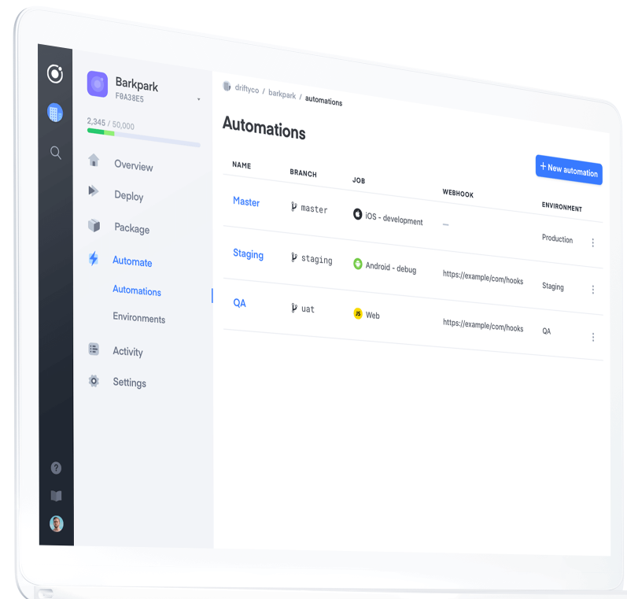

# olian.me
Home of my soon(tm) to be (new)portfolio site

_Note: Design is taken from the ionic doc page._

## What to show

The dark grey menu on the far left should show different tabs: About me, projects, contact me.
In the project tab (the one shown in the design img) the light gray menu on the left should contain the different categories of projects ive made, as well as an option to search through all of them.  
Websites, Packages (NPM, Go, PIP, Rust, etc), Apps (programs), Opensource (Github repos, Gitlab repos, Bit bucket repos, etc). 

Each category should have a table (like in the design) with each row of the table representing a project, and each column representing a certain kind of information, like the name and/or logo of the project, the kind of project it is (NPN, Go, PIP / Github, Gitlab, Bitbucket), URL (source URL, website URL, demo URL, docs URL), 1 sentence description, status (Project owner, Contributor / Archived, WIP, Deployed), edit (3 dots).

If logged in as admin you should be able to add new projects directly in the GUI & edit already added project, like changing the different fields (name, URL, etc..) or deleting it entiarly.

## Technical info

The page should be written in Vue and should be an offline enabled PWA.

## Resources

* For displaying github repos: https://github.com/Olian04/github-readme
